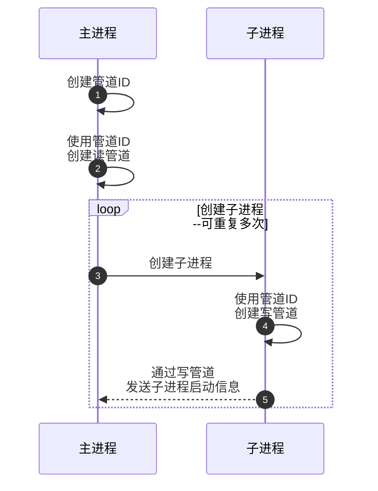

```mermaid
sequenceDiagram
    autonumber
    participant A as 主进程
    participant B as 子进程
    A ->> A: 创建管道ID
    A ->> A: 使用管道ID<br>创建读管道
    loop 创建子进程<br>--可重复多次
        A ->> B: 创建子进程
        B ->> B: 使用管道ID<br>创建写管道
        B -->> A: 通过写管道<br>发送子进程启动信息
    end
```